# Cashflow Database ERD

PostgreSQL · 3NF · typed Mermaid diagrams for all schemas.

Apply schema: python -m cashflow_db migrate

# Cashflow Database ERD (Mermaid)

PostgreSQL · 3NF · كل جدول بأعمدة وأنواع. الرسمة مقسومة domains عشان تفضل واضحة (رسمة واحدة بكل الأعمدة بتبقى غير مقروءة).

**اصطلاحات الأنواع:** `uuid` PK surrogate · `timestamptz` · `numeric(14,2)` فلوس · `jsonb` payloads · `text[]` قوائم بسيطة.

**أعمدة lineage مشتركة على كل Fact كبير:** `source_system text`, `source_natural_key text`, `etl_run_id uuid FK`, `created_at timestamptz` (مذكورة صراحة في الجداول الأساسية؛ ضمناً على الباقي).

**Case-centric identity:** clinical `VISIT` = `(case_pk, service_date)` · first-class `SCHEDULE_APPOINTMENT` = `(case_pk, appointment_at)` · Snowflake KPI = `(emr_id, date_of_service)` only.

**Operational spine (013):** `billing.reconciliation_run` / `reconciliation_line` / `reconciliation_visit_agg` · `analytics.payor_behavior_summary` / `checks_timeline` / `forecast_feature` · forecast_run lineage (`reconciliation_run_id`, `rules_version`, `source_etl_run_ids`). Consumers use `cashflow_db.repository` — see [`deprecation_plan.md`](deprecation_plan.md).

**Pipeline control (014):** `ops.pipeline_run` / `stage_run` / `stage_artifact` / `retry_item` / `alert_event` / `daily_snapshot` / `forecast_accuracy_day` — workflow engine state for the daily RCM Processing Platform (`cashflow_ops`). See [`rcm_platform.md`](rcm_platform.md).

**Monitoring / platform qualities (015):** schema `monitoring` — typed `pipeline_metric`, `pipeline_event`, `job_runtime`, `quality_metric`/`quality_rule`, `sla_definition`, `system_config`/`system_health`, `backfill_run`/`backfill_day`. Feature store: `analytics.feature_definition` + `feature_snapshot`. `dataset_version` on pipeline/recon/forecast/snapshot.

---

## 0) خريطة عالية المستوى

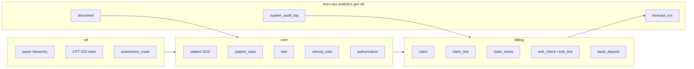

---

## 1) `ref` — Reference data

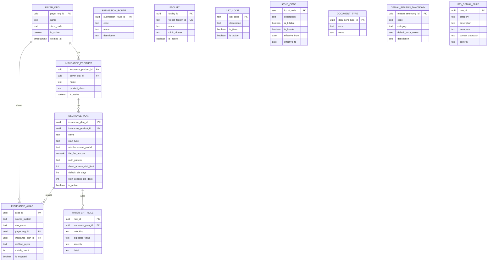

`product_class`: `commercial|medicaid|medicare|workers_comp|no_fault|other`  
`reimbursement_model`: `percent_of_charge|flat_per_visit`  
`auth_pattern`: `pattern_based|pre_service|none_dummy`  
`submission_route.code`: `waystar|zaya|manual`  
`document_type.code`: `referral|poc|prescription|denial|appeal|mri|lab|daily_note|remittance|other`

---

## 2) `etl` + `gov`

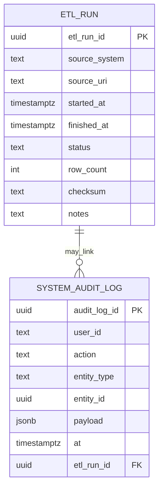

`source_system`: `webpt|revflow|tracker|mail|rules|waystar|zaya|snowflake|manual`  
`status`: `running|success|failed|partial`

---

## 3) `core` — Patient, Case, Coverage, Auth, Visit, Note

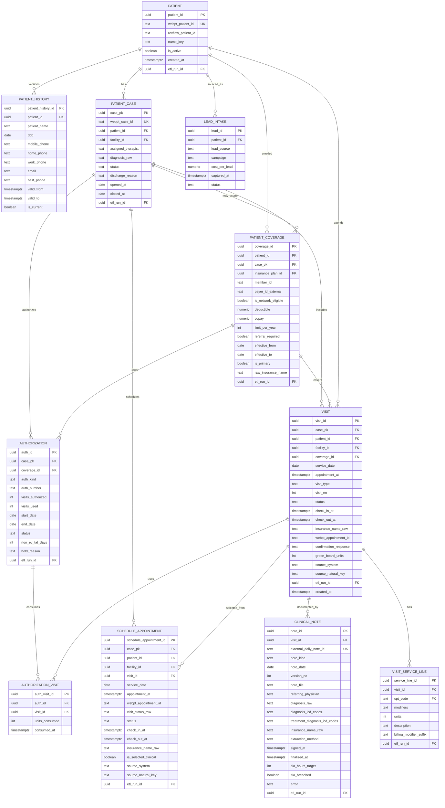

**Enums مهمة**

| عمود | قيم |
|------|-----|
| `patient_case.status` | `active\|partial_discharge\|full_discharge\|closed` |
| `authorization.auth_kind` | `hard\|dummy` |
| `authorization.status` | `approved\|non_ev\|on_hold\|expired\|exhausted` |
| `authorization.hold_reason` | `cob\|missing_referral\|insurance_change\|md_pending\|other` |
| `visit.visit_type` | `follow_up\|initial\|re_examination` |
| `visit.status` | `scheduled\|confirmed\|completed\|cancelled\|no_show\|unchecked_out` |
| `visit.confirmation_response` | `C\|R\|X\|none` |
| `clinical_note.note_kind` | `initial\|daily\|correction\|addendum\|poc\|recert` |
| `lead_source` | `phone\|zocdoc\|website\|zoho\|google_ads\|other` |

**قاعدة أعمال:** `authorization.end_date` يغلب `visits_authorized - visits_used`. Dummy `auth_number = '0'` ≠ صفر زيارات.

---

## 4) `billing` — Claim lifecycle + money

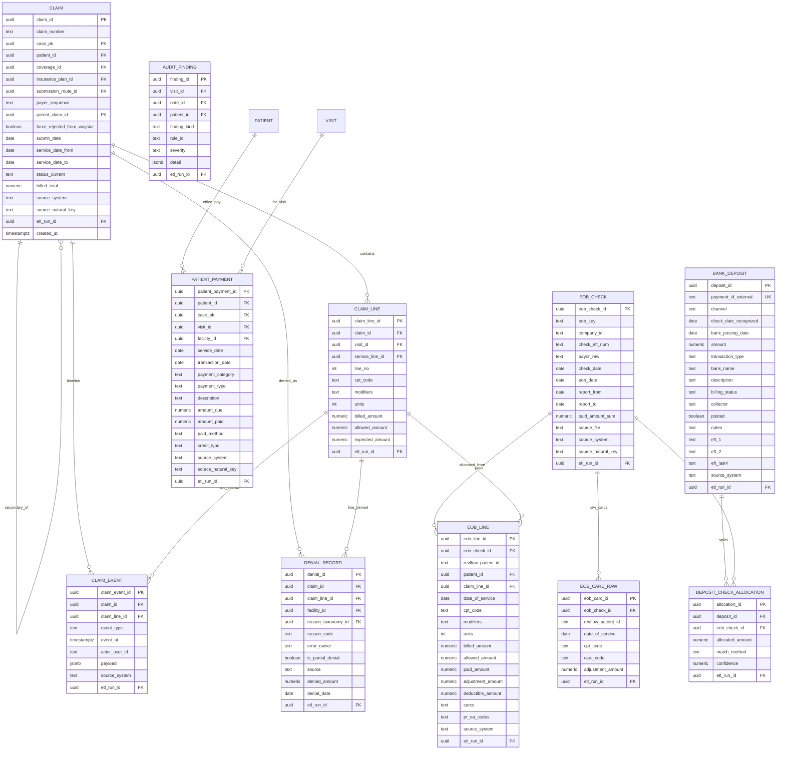

`patient_payment.payment_category`: `Copay|Other|Wellness|Deductible|Supplies|Internal Payment`

**Enums مهمة**

| عمود | قيم |
|------|-----|
| `claim.payer_sequence` | `primary\|secondary` |
| `claim.status_current` | آخر `event_type` / ملخص حالة |
| `claim_event.event_type` | `created\|internal_hold\|ready_for_submission\|submitted\|force_rejected_waystar\|submitted_zaya\|dropped_unsubmitted\|clearinghouse_rejected\|accepted\|payer_denied\|era_received\|appealed\|adjusted\|patient_responsibility\|self_pay_converted\|deposit_posted\|closed\|merged\|relinked` |
| `denial_record.error_owner` | `front_desk\|medical_audit\|authorization\|coding\|payer_behavior` |
| `audit_finding.finding_kind` | `cpt_rule\|icd_rule` |
| `bank_deposit.channel` | `eft\|mail_check\|v_card\|direct_deposit\|ach\|other` |
| `allocation.match_method` | `eft1\|eft2\|manual\|mail_sheet\|last4` |
| `pr_oa_codes` | `PR1\|PR2\|PR3\|OA23` + CARCs |

**سلسلة المال:** `VISIT_SERVICE_LINE → CLAIM_LINE → EOB_LINE` و `BANK_DEPOSIT ↔ EOB_CHECK` عبر allocation (M:N).  
**Dual dates:** ledger = `eob_check.check_date` · liquidity = `bank_deposit.bank_posting_date`.

---

## 5) `docs` — Documents + OCR

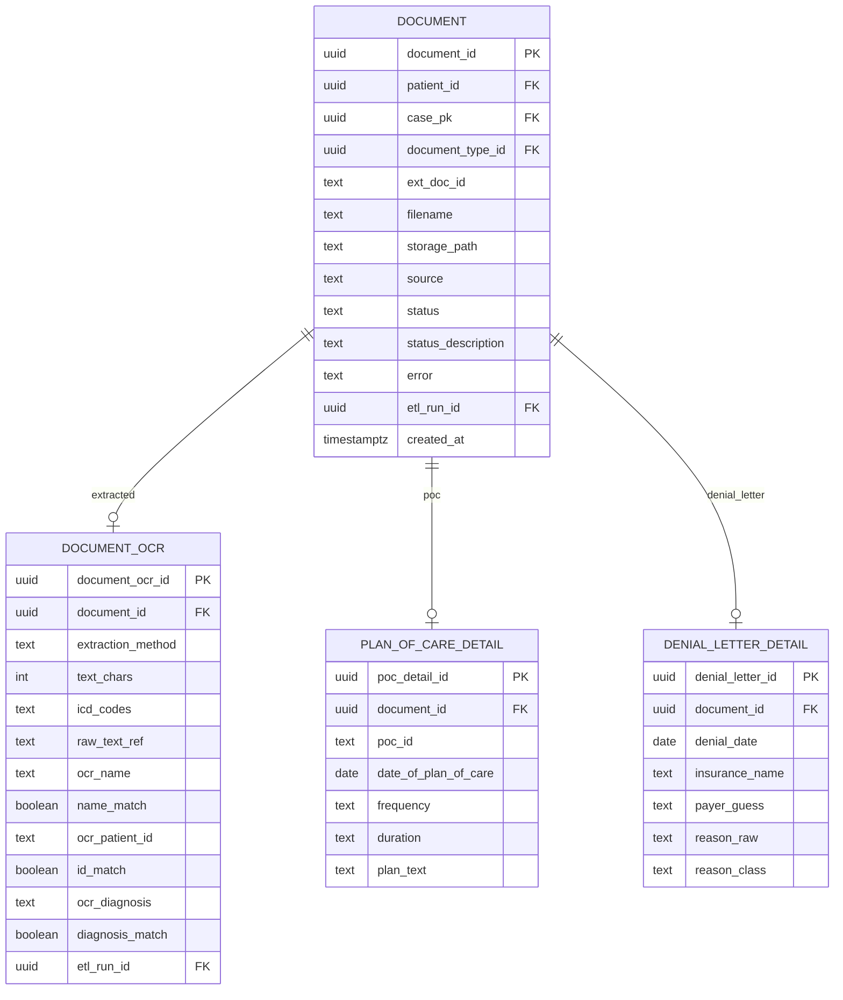

`document.source`: `edoc|chart_note|upload|mail|drive`

---

## 6) `ops` — Mail / CC / issues

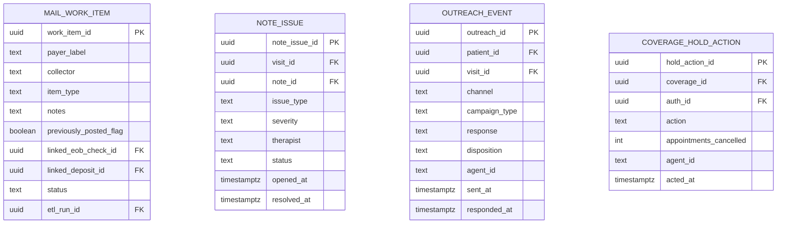

`mail item_type`: `eob|check|eob_and_check` · `outreach.channel`: `sms|call|email` · `campaign_type`: `next_day_confirm|no_upcoming|auth_approval|self_discharge`

`NOTE_ISSUE` / `OUTREACH_EVENT` = Phase 2 جداول محجوزة في الـ ERD.

---

## 7) `analytics` — Versioned forecast + Snowflake KPI staging

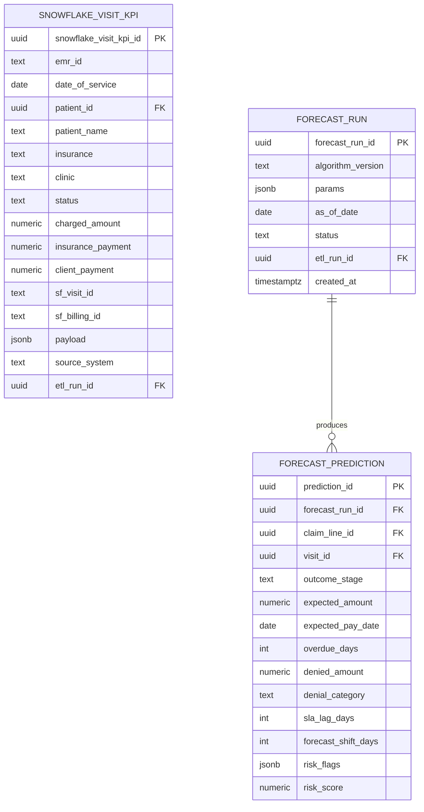

`outcome_stage`: `paid|on_track|overdue|rejected|denied|zero_pay`  
`params` يسجّل: first_pass_target, denial_shift_cycles, medical_audit_delay_pct, auth_delay_pct, high_season_sla — **ممنوع overwrite لتوقعات run قديم**.

---

## 8) `finance` — Phase 3 stubs فقط

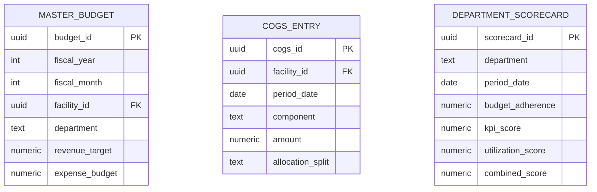

`cogs.component`: `labor|supplies|direct_utilities|documentation`

---

## 9) علاقات عابرة للـ schemas (الملخص)

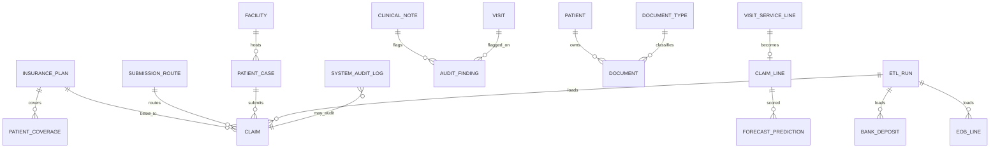

---

## 10) قائمة الجداول الكاملة (36 + 3 finance stubs)

| Schema | Tables |
|--------|--------|
| `ref` | payer_org, insurance_product, insurance_plan, submission_route, facility, cpt_code, icd10_code, document_type, denial_reason_taxonomy, insurance_alias, payer_cpt_rule, icd_denial_rule |
| `etl` | etl_run |
| `gov` | system_audit_log |
| `core` | patient, patient_history, patient_case, patient_coverage, lead_intake, authorization, authorization_visit, visit, clinical_note, visit_service_line |
| `billing` | claim, claim_line, claim_event, denial_record, audit_finding, eob_check, eob_line, eob_carc_raw, bank_deposit, deposit_check_allocation |
| `docs` | document, document_ocr, plan_of_care_detail, denial_letter_detail |
| `ops` | mail_work_item, note_issue, outreach_event, coverage_hold_action, pipeline_run, stage_run, stage_artifact, retry_item, alert_event, daily_snapshot, forecast_accuracy_day |
| `monitoring` | pipeline_metric, quality_metric, quality_rule, job_runtime, system_health, pipeline_event, sla_definition, system_config, backfill_run, backfill_day |
| `analytics` (+015) | feature_definition, feature_snapshot (plus forecast_*) |
| `analytics` | forecast_run, forecast_prediction |
| `finance` | master_budget, cogs_entry, department_scorecard |

**Phase 1 للتنفيذ الفعلي:** كل `ref` + `etl` + `gov` + `core` (بدون lead_intake إن حابب) + `billing` + `docs` + `ops.mail_work_item` + `analytics`.  
**Phase 2:** lead_intake, note_issue, outreach_event, coverage_hold_action.  
**Phase 3:** finance stubs.

---

## 11) Pipeline control (`ops` — migration 014)

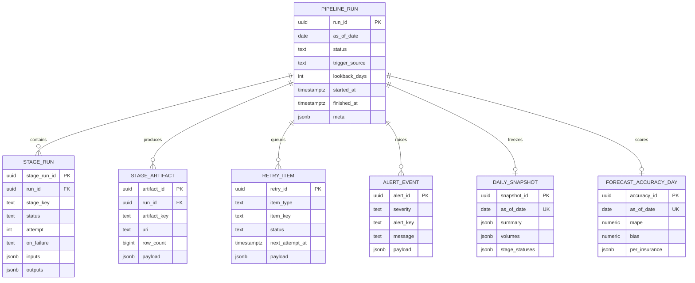

---

## ملاحظات العرض

- Mermaid `erDiagram` يعرض الأنواع بجانب الأعمدة؛ في Cursor/GitHub اضغط Preview على كل بلوك.
- لو عايز ملف واحد للطباعة لاحقاً عند التنفيذ: `docs/erd.md` بنفس المحتوى + اختياري تصدير PNG عبر mermaid-cli.
- الـ CSV المكررة (`patients_export_*`, `projected_cash_*`, …) **مش جداول** — Views فوق الـ ERD ده.
- Daily orchestration: [`rcm_platform.md`](rcm_platform.md) (`python -m cashflow_ops`).
